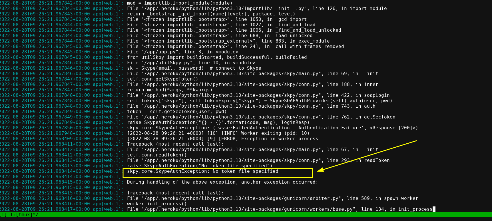

# skype bot builder

Using
- flask backend
- (TODO: Work more it) express backend - There is no suitable skype bot service in javascript ecosystem yet.

# For reference

Heroku Official Guide for publishing python project (their project uses django sample application deloyment): [Click here](https://devcenter.heroku.com/articles/getting-started-with-python)

- Heroku's official repo of **sample django project github repository** for heroku: [Click here](https://github.com/heroku/python-getting-started)

# Insatlling new dependencies in python project and push to heroku

#### Way 1 - [Heroku's Guide's Way](https://devcenter.heroku.com/articles/getting-started-with-python#push-local-changes)

- Add dependency to `requirements.txt` file manually in the end, i.e., adding a dependency `requests` below (FILE: `requirements.txt`):

    ```bash
    django>=4.0,<5.0
    gunicorn>=20.0,<21.0
    dj-database-url>=1.0,<2.0
    whitenoise>=6.0,<7.0
    psycopg2>=2.0,<3.0
    requests
    ```

- Now you need to install it via: 

    ```bash
    . venv/bin/activate
    pip install -r requirements.txt
    ```

**You're done!**

#### Way 2 - Tekena's way:

- Install dependency
    ```bash
    . venv/bin/activate
    pip install Flask
    ```
- Now overwrite complete `requirements.txt` file:

```bash
pip freeze > requirements.txt
```

**You're done!**

# Heroku hello world with flask

Source: Article on Medium: [Deploying a Flask application on Heroku](https://medium.com/@gitaumoses4/deploying-a-flask-application-on-heroku-e509e5c76524) ~ Moses Gitau

TODO: Refernce of another good article of doing same thing: https://realpython.com/flask-by-example-part-1-project-setup/

```bash
# create heroku app named `your-first-heroku-app` with python buildpack
heroku create your-first-heroku-app --buildpack heroku/python

# add heroku remote to repository
heroku git:remote -a your-first-heroku-app

# install gunicorn
pip install gunicorn

# create requirements.txt
pip freeze > requirements.txt

# create Procfile # LEARN: The first app represents the name of the python file that runs your application or the name of the module it is in. The second app represents your app name.
echo "web: gunicorn app:app" > Procfile
```

- IF YOU don't have `app.py` file but have your app named as `run.py` then your Procfile should be like:

```
web: gunicorn run:my_awesome_app
```

```py
# FILE: run.py
from flask import Flask

my_awesome_app = Flask(__name__)


@my_awesome_app.route('/')
def hello_world():
    return 'Hello World!'


if __name__ == '__main__':
    my_awesome_app.run()
```

- Push to master branch of heroku:

```
git push heroku master
# or push from other than master branch:
git push heroku develop:master
```

# deployment to heroku doesn't work!!

